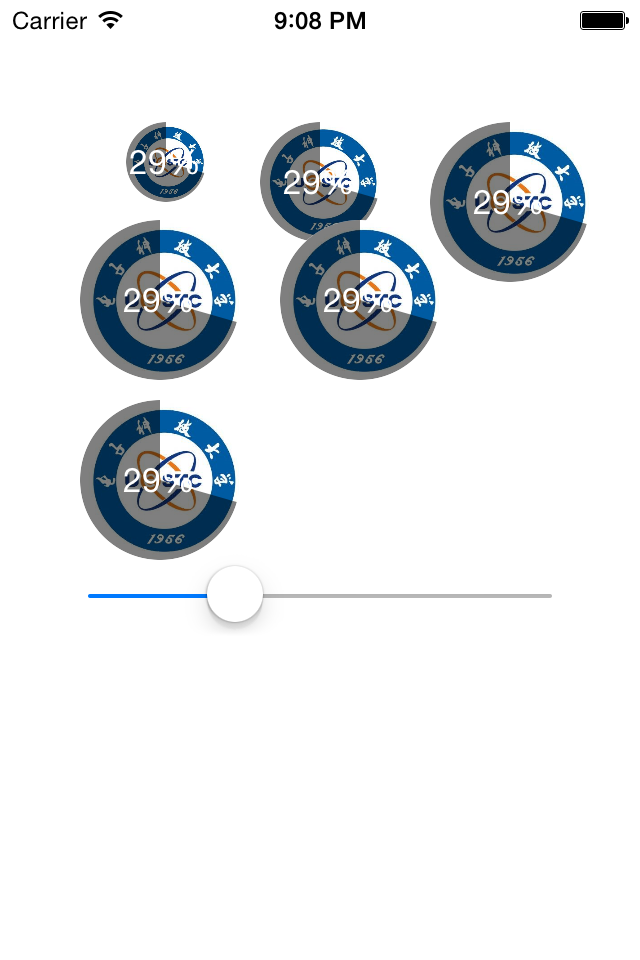
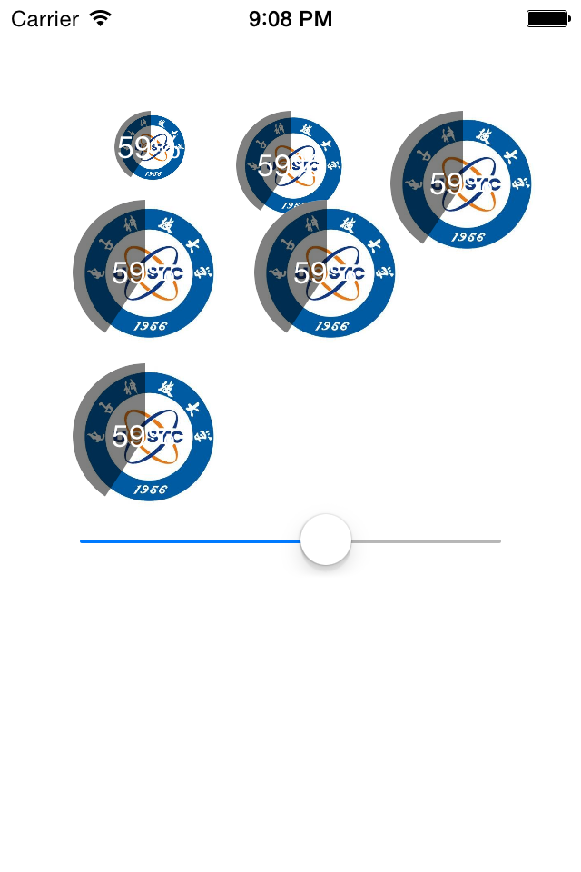
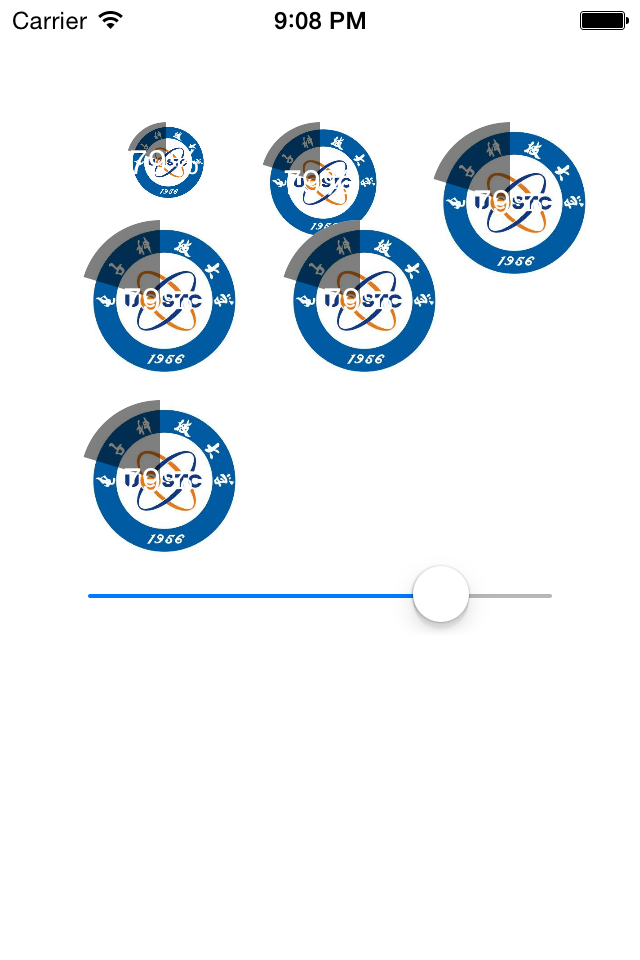

# VKProgressImageView
A subclass of UIImageView which has a progress view on it.

##NOTICE
####Currently, it should be rounded, so,just make the width and height equal.But I will fix this lately.
####The alpha of the mask couldn't be set directly but I will add this function as soon as possible.
####The progress label can be hidden but I didn't add this interface now, you should do it manually

##USAGE
###It can be created by Code and Interface Builder.
####make the mask the main color of the image, this function will be added after I am sure it works fine! 
	-(void)setInverseEnable:(BOOL)enable NS_UNAVAILABLE;

####set the progress shown on the image view
	-(void)setProgress:(float)progress;

##Preview

